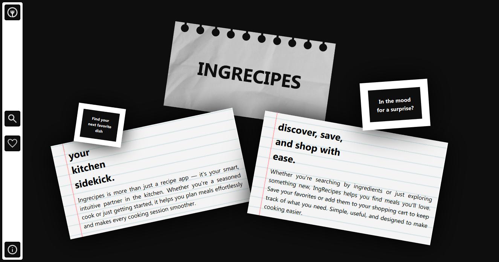
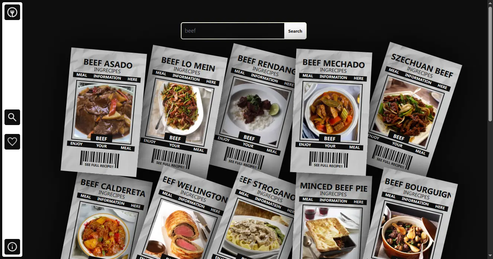
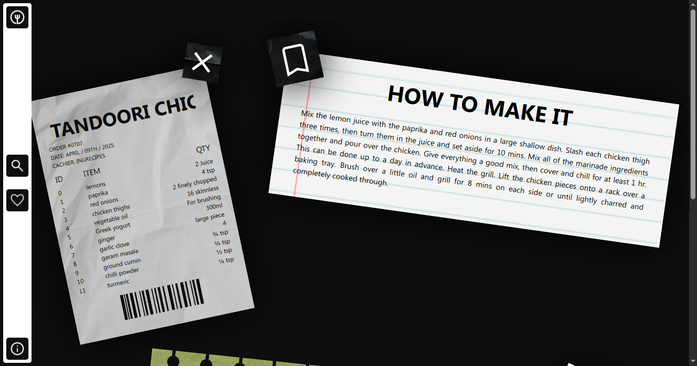

# CookIQ

## Overview
**CookIQ** is designed to help users find recipes by entering a main ingredient to filter meals or by searching for a meal by name. The goal is to simplify meal planning and cooking by offering personalized recipe recommendations.

## Live Demo
Check out the live demo [HERE](https://auilk.github.io/CookIQ/)

## Features
- Search recipes by name or main ingredient
- See the full recipe details: ingredients, instructions, images, and more.

## Technologies Used
This project is built using
- [React](https://react.dev/)
- [Vite](https://vite.dev/) (for fast development)
- [TailwindCSS](https://tailwindcss.com/)
- [TheMealDB API](https://www.themealdb.com/) (for fetching recipes)
- [Zustand](https://zustand-demo.pmnd.rs/)

## Getting Started

### Prerequisites

- Node.js (v14 or higher)
- npm or yarn
- PHP 7.4 or higher
- MySQL 5.7 or higher
- WAMP/XAMPP (for local development)

### Installation

1. Clone the repository:
```bash
git clone https://github.com/auilk/CookIQ.git
cd CookIQ
```

### Install Dependencies:
```bash
npm install
```

# Start the Development Server:
```bash
npm run dev
```

## API Usage
This app fetches recipe data from TheMealDB API to provide users with a variety of meal options. Users can search for meals by name or filter recipes based on ingredients they have.

## Screenshots





## Contributing
Feel free to contribute by submitting a pull request or reporting issues!

## License
This project is open-source and available under the MIT License. See [LICENSE](LICENSE) for more detail.